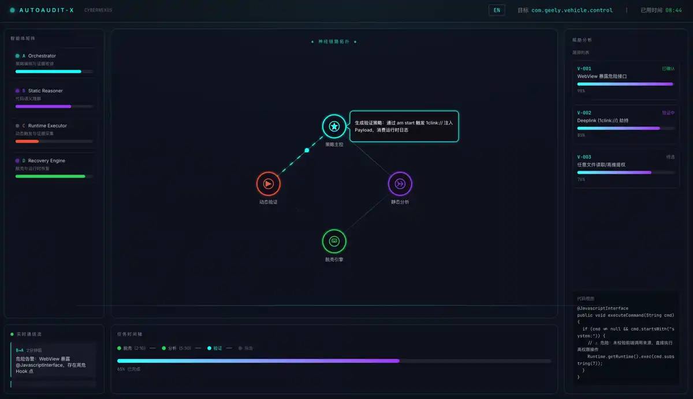
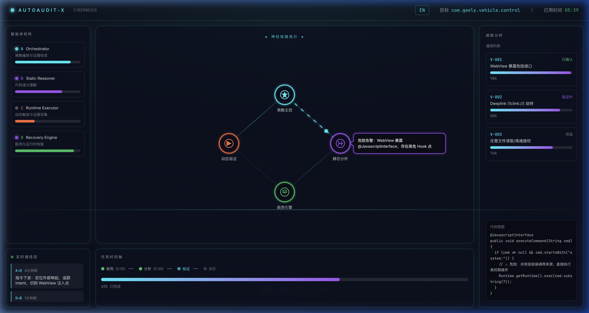

# AutoAudit-X · CyberNexus


**[English](#english) | [中文](#中文)**

---

## English

> [!WARNING]
> 🚧 This project is actively under development. APIs and structure may change at any time.

**AutoAudit-X** is a multi-agent intelligent Android security audit system. Four specialized AI agents collaborate in real time to automatically discover and verify vulnerabilities in Android APKs.

### 🎬 Demo


### 📸 Screenshot


### ✨ Features

| Module | Description |
|--------|-------------|
| 🧠 **Orchestrator** | Strategy controller, coordinates all agents |
| 🔬 **Static Reasoner** | Static code analysis, detects dangerous interfaces & injection points |
| ⚡ **Runtime Executor** | Dynamic verification, triggers Deeplink / WebView exploits |
| 🛡️ **Recovery Engine** | Failure recovery with resilient retry and fallback |
| 📡 **Neural Link Topology** | Real-time visualization of inter-agent communication |
| 📊 **Threat Panel** | Vulnerability scoring and code traceability |
| 🕒 **Mission Timeline** | Audit lifecycle progress tracking |

### 🚀 Quick Start

```bash
git clone https://github.com/cxf-boluo/AutoAudit-X.git
cd AutoAudit-X/dashboard
npm install
npm run dev
```

Open [http://localhost:5174](http://localhost:5174) to view the dashboard.

### 🏗️ Tech Stack

- **Frontend**: React 18 + TypeScript + Vite
- **Visualization**: SVG-based animated Neural Topology
- **Styling**: Vanilla CSS with glassmorphism & neon aesthetics

---

## 中文

> [!WARNING]
> 🚧 **本项目目前仍在积极开发中，部分功能尚未完善，接口与结构可能随时变更。** 欢迎 Star 关注进展！

**AutoAudit-X** 是一个多智能体驱动的 Android 安全自动化审计平台。四个专业 AI Agent 实时协作，对 Android APK 进行漏洞自动化发现与验证。

### 🎬 演示



### 📸 截图



### ✨ 功能模块

| 模块 | 说明 |
|------|------|
| 🧠 **Orchestrator** | 策略主控，统一调度四大 Agent |
| 🔬 **Static Reasoner** | 静态代码分析，识别高危接口与注入点 |
| ⚡ **Runtime Executor** | 动态执行验证，Deeplink / WebView 漏洞触发 |
| 🛡️ **Recovery Engine** | 失败恢复，弹性重试与核心组件兜底 |
| 📡 **Neural Link Topology** | 实时可视化 Agent 间通信拓扑与消息气泡 |
| 📊 **Threat Panel** | 漏洞等级评分与代码溯源展示 |
| 🕒 **Mission Timeline** | 审计任务生命周期进度追踪 |

### 🚀 快速开始

```bash
git clone https://github.com/cxf-boluo/AutoAudit-X.git
cd AutoAudit-X/dashboard
npm install
npm run dev
```

访问 [http://localhost:5174](http://localhost:5174) 查看大屏 Dashboard。

### 🏗️ 技术栈

- **前端框架**: React 18 + TypeScript + Vite
- **可视化**: SVG 驱动的动态神经拓扑图
- **样式**: 原生 CSS，毛玻璃 + 赛博霓虹风格
