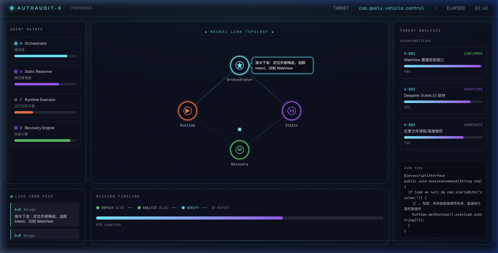

# AutoAudit-X · CyberNexus

> **Multi-Agent Intelligent Android Security Audit System**  
> 多智能体驱动的 Android 安全自动化审计平台

---

## 🎬 Demo


> *Neural Link Topology — 四智能体实时协作拓扑图*

---

## 📸 Screenshot



---

## ✨ Features

| 模块 | 说明 |
|------|------|
| 🧠 **Orchestrator** | 策略主控，统一调度四大 Agent |
| 🔬 **Static Reasoner** | 静态代码分析，识别高危接口与注入点 |
| ⚡ **Runtime Executor** | 动态执行验证，Deeplink / WebView 漏洞触发 |
| 🛡️ **Recovery Engine** | 失败恢复，弹性重试与核心组件兜底 |
| 📡 **Neural Link Topology** | 实时可视化 Agent 间通信拓扑与消息气泡 |
| 📊 **Threat Panel** | 漏洞等级评分与代码溯源展示 |
| 🕒 **Mission Timeline** | 审计任务生命周期进度追踪 |

---

## 🚀 Quick Start

```bash
# Clone
git clone https://github.com/cxf-boluo/AutoAudit-X.git
cd AutoAudit-X/dashboard

# Install & run
npm install
npm run dev
```

访问 [http://localhost:5174](http://localhost:5174) 查看大屏 Dashboard。

---

## 🏗️ Tech Stack

- **Frontend**: React 18 + TypeScript + Vite
- **Visualization**: SVG-based animated Neural Topology
- **Styling**: Vanilla CSS with glassmorphism & neon aesthetics


